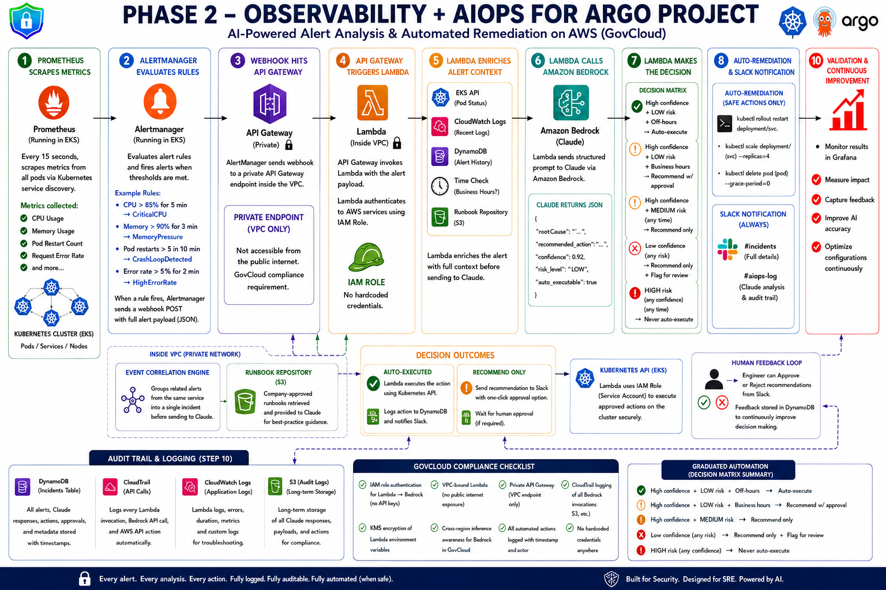

# Phase 2 — Observability + AIOps

AI-powered alert analysis and automated remediation on AWS (GovCloud-compatible).

## What This Layer Does

Closes the gap between detection and response:

```
Prometheus detects anomaly
         ↓
AlertManager fires webhook
         ↓
Lambda enriches context + calls Claude via Bedrock
         ↓
Graduated automation decision
         ↓
Auto-remediate (safe actions) or recommend (human approval)
         ↓
Slack notification + DynamoDB audit trail
```

## Structure

```
observability/
├── prometheus/
│   ├── values.yaml
│   └── alert-rules.yaml
├── grafana/
│   ├── datasource.yaml
│   └── dashboards/
│       └── kubernetes-overview.json
└── aiops/
    ├── terraform/
    └── lambda/
        ├── handler.py
        ├── validator.py
        ├── context.py
        ├── ai_engine.py
        ├── policy.py
        ├── executor.py
        ├── notifier.py
        ├── audit.py
        ├── utils.py
        └── requirements.txt
```

## The 20-Step Pipeline

| Step | Module | Action |
|---|---|---|
| 1 | handler.py | Receive AlertManager webhook |
| 2 | validator.py | Validate alert structure |
| 3 | validator.py | Normalize alert fields |
| 4 | validator.py | Deduplicate — prevent reprocessing |
| 5 | audit.py | Create incident record in DynamoDB |
| 6 | context.py | Gather Kubernetes pod status |
| 7 | context.py | Pull recent pod logs from CloudWatch |
| 8 | context.py | Retrieve incident history from DynamoDB |
| 9 | context.py | Load approved runbook from S3 |
| 10 | context.py | Determine business context and time |
| 11 | context.py | Correlate related alerts |
| 12 | ai_engine.py | Build controlled AI prompt |
| 13 | ai_engine.py | Call Claude via Amazon Bedrock |
| 14 | validator.py | Validate AI response structure |
| 15 | policy.py | Apply graduated automation safety policy |
| 16 | executor.py | Execute approved action |
| 17 | executor.py | Verify action succeeded |
| 18 | notifier.py | Send Slack notification |
| 19 | audit.py | Write complete audit trail |
| 20 | handler.py | Return response to API Gateway |

## Graduated Automation Decision Matrix

| Condition | Action |
|---|---|
| Escalate flag set | Page on-call immediately |
| Production environment | Recommend only |
| HIGH risk (any confidence) | Recommend only |
| Confidence below 85% | Recommend only |
| Claude says not auto-executable | Recommend only |
| MEDIUM risk (any time) | Recommend only |
| LOW risk + HIGH confidence + off-hours | Auto-execute |
| LOW risk + HIGH confidence + business hours | Recommend with approval |

## Alert Rules

| Alert | Condition | Severity |
|---|---|---|
| CrashLoopDetected | Pod restarts > 5 in 10 min | Critical |
| OOMKillDetected | Container killed — out of memory | Critical |
| CriticalCPU | CPU > 85% for 5 min | Warning |
| MemoryPressure | Memory > 90% for 3 min | Warning |
| HighErrorRate | HTTP 5xx > 5% for 2 min | Critical |

## GovCloud Compliance

- IAM role authentication for Lambda to Bedrock — no API keys
- VPC-bound Lambda — no public internet exposure
- Private API Gateway — VPC endpoint only
- CloudTrail logging of all Bedrock invocations
- KMS encryption of Lambda environment variables and DynamoDB
- All automated actions logged with timestamp and actor
- No hardcoded credentials anywhere

## Installation

### 1. Deploy Prometheus and Grafana

```bash
helm repo add prometheus-community https://prometheus-community.github.io/helm-charts
helm repo update

helm install prometheus prometheus-community/kube-prometheus-stack \
  --namespace monitoring \
  --create-namespace \
  --values observability/prometheus/values.yaml

kubectl apply -f observability/prometheus/alert-rules.yaml
```

### 2. Deploy AIOps Lambda

```bash
cd observability/aiops/terraform
cp terraform.tfvars.example terraform.tfvars
terraform init
terraform plan
terraform apply
```

### 3. Create Slack webhook secret

```bash
aws secretsmanager create-secret \
  --name aiops/slack-webhook \
  --secret-string "https://hooks.slack.com/services/YOUR/WEBHOOK/URL"
```

